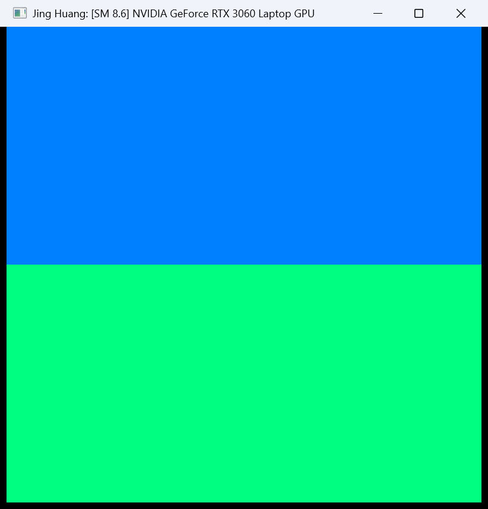
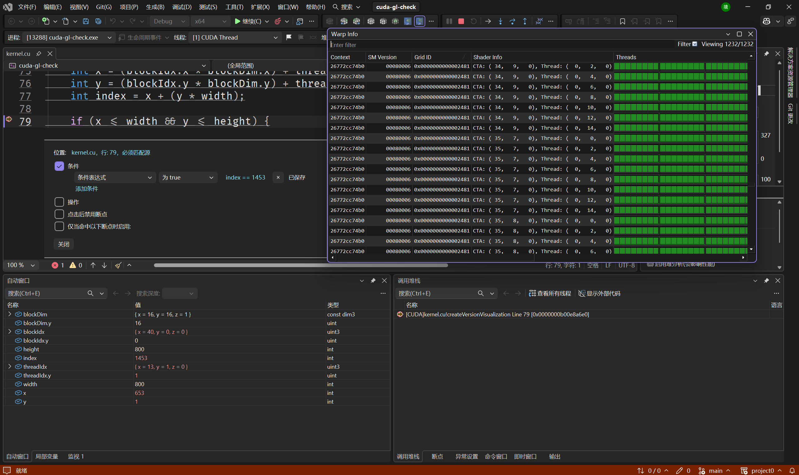
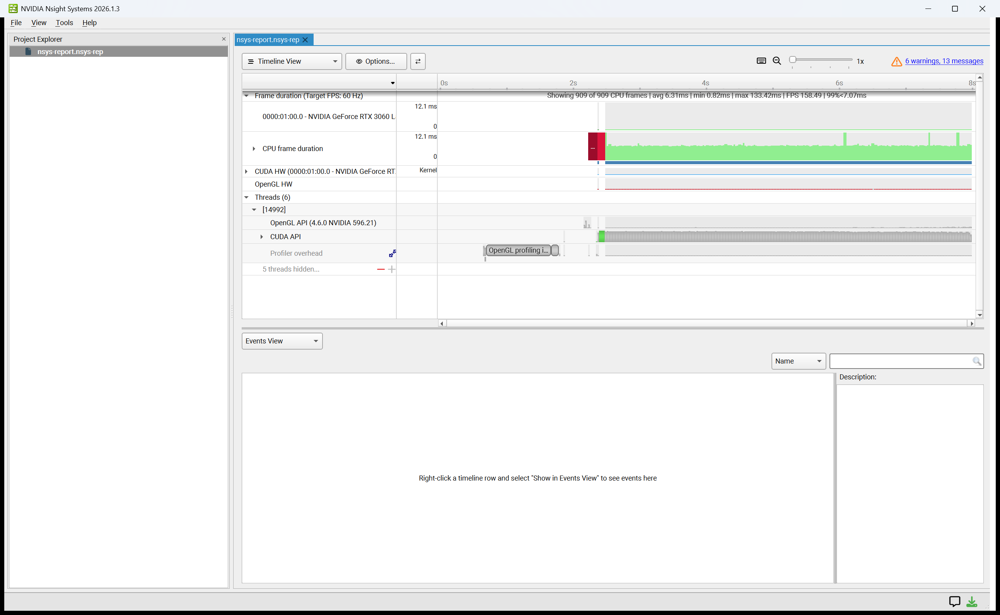
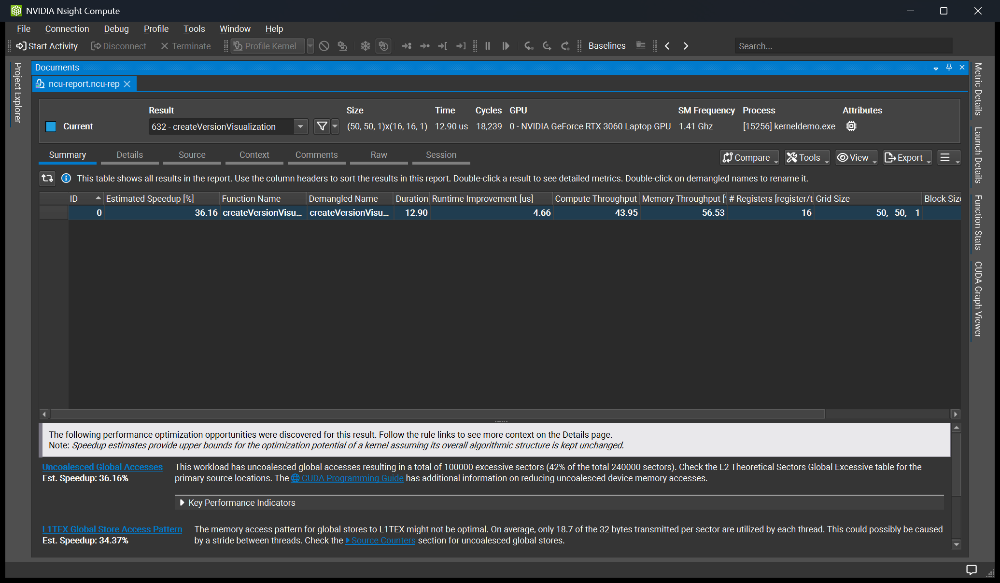
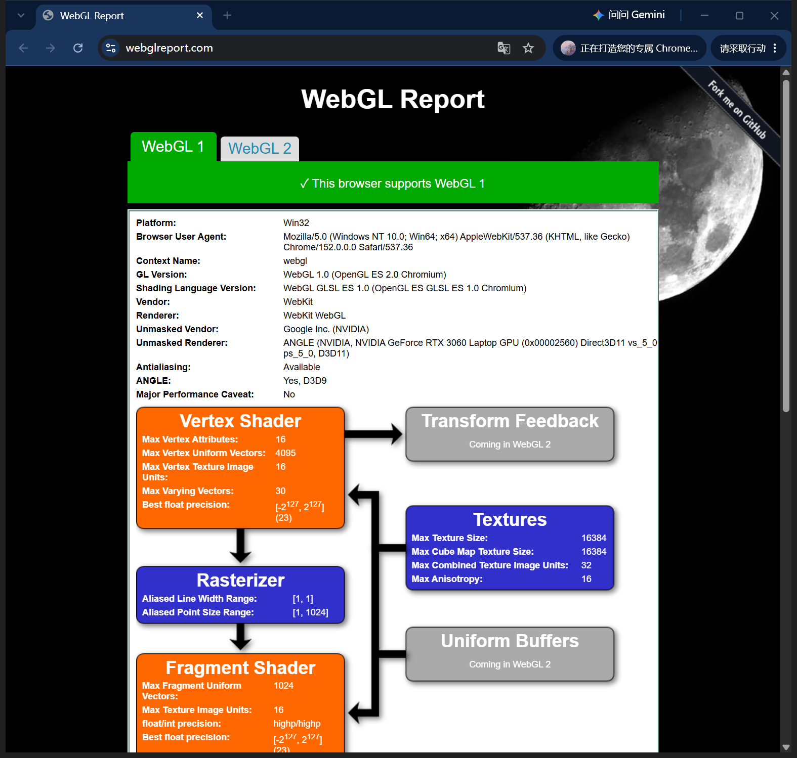
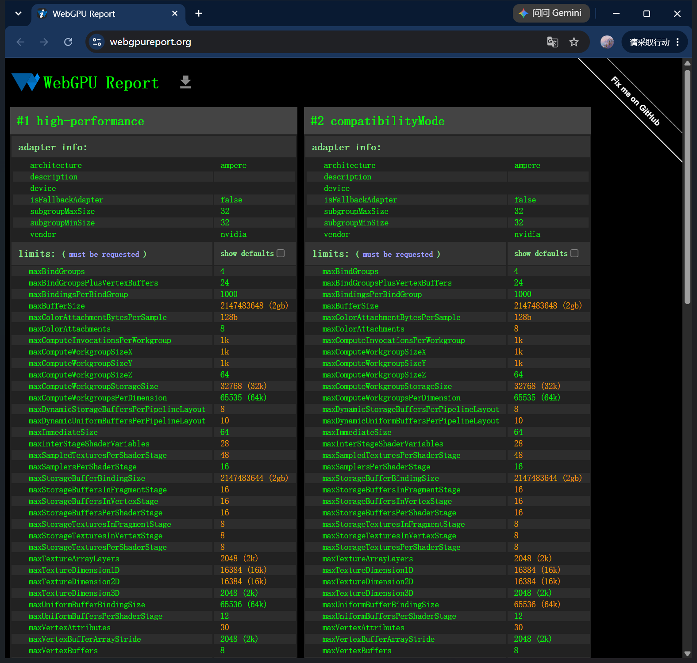

# Project 0 Getting Started

**University of Pennsylvania, CIS 5650: GPU Programming and Architecture, Project 0**

* **Jing Huang**
  * [GitHub](https://github.com/Stabil1ze)
* Tested on: Windows 11, Intel i7-12700H @ 2.30GHz 23GB, NVIDIA GeForce RTX 3060 Laptop GPU 6GB (Personal computer)

## Part 2.1: CUDA GL Check

The program verifies that CUDA and OpenGL work together correctly on my machine by
rendering a color-coded visualization of the GPU's Compute Capability (`SM 8.6`).

The top half of the window is colored according to the **major** version (`8` -> Dodger Blue),
and the bottom half according to the **minor** version (`6` -> Spring Green). The window title
also reports the device: `Jing Huang: [SM 8.6] NVIDIA GeForce RTX 3060 Laptop GPU`.

### 2.1.2 Window

### 2.1.3 Nsight Debugging

Using the Nsight debugger I set a breakpoint at `if (x <= width && y <= height) {` in
`kernel.cu`, stepped through warps with *Next Active Warp*, and inspected the values of
`blockIdx`, `threadIdx`, `index`, etc. The breakpoint was also set with a conditional
expression to stop at a specific `index`.

### 2.1.4 Nsight Systems

I profiled the application with Nsight Systems to visualize the CPU/GPU timeline and
identify the overall application behavior.

### 2.1.5 Nsight Compute

I profiled the `createVersionVisualization` kernel with Nsight Compute (full section set)
to inspect its occupancy, memory throughput, and other detailed performance metrics.

## Part 2.2: WebGL

WebGL is enabled and hardware-accelerated in Google Chrome:

## Part 2.3: WebGPU

WebGPU is available in Google Chrome, reporting the NVIDIA GeForce RTX 3060 Laptop GPU
as the adapter:

## Comments

* The CUDA GL Check application built successfully on Windows using Visual Studio 2026
  and CUDA Toolkit 13.3. No modifications were made to `CMakeLists.txt`.
* The `main.cpp` `m_yourName` value was changed to display my name in the window title.
* Note: CUDA-OpenGL interoperability is **not** supported inside WSL2, so the interactive
  window must be built and run natively on Windows (this is a known NVIDIA WSL limitation).
